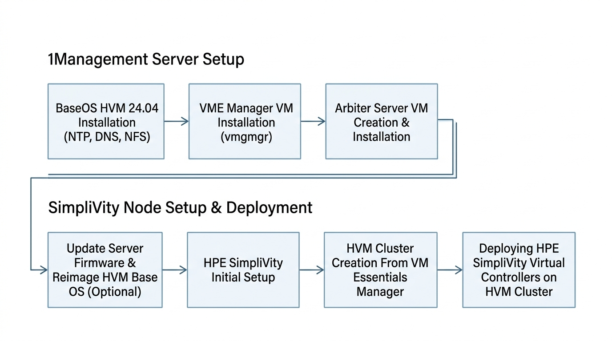
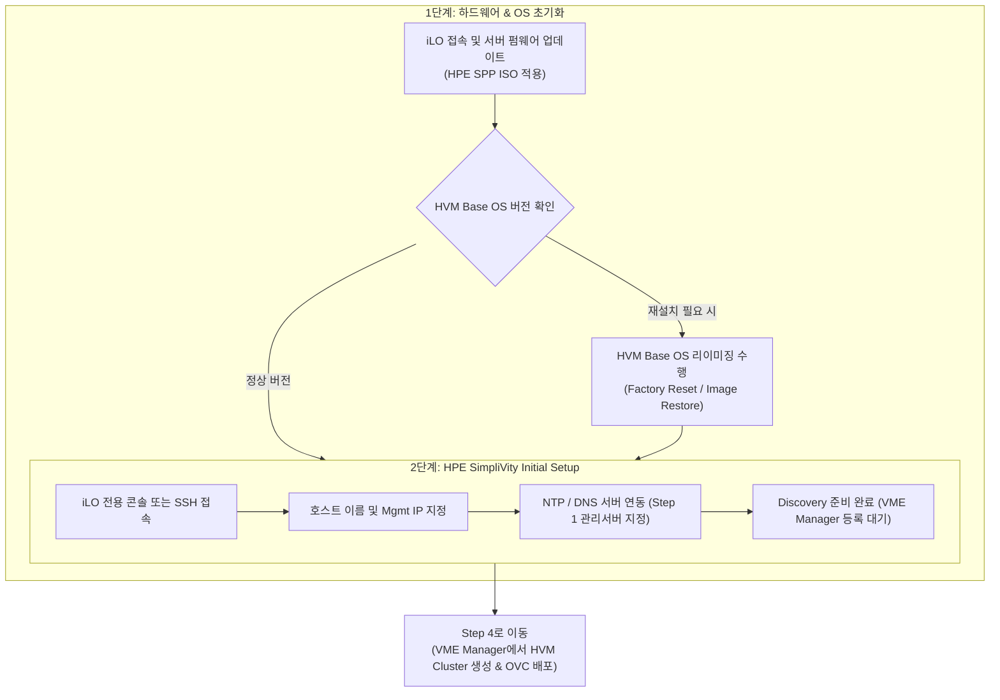

> **작성자**: 15년 차 IT 필드 엔지니어  
> **기준 문서**: HPE SimpliVity 6.2.0 for HPE Morpheus VM Essentials Software Guide (sd00006914en_us)

> 📌 **HPE SimpliVity 6.2.0 (HVM) 실전 구축 연재 목차**
> 
> - **[Step 1. 관리서버 BaseOS HVM 24.04 & NTP/DNS/NFS 구성](../01_관리서버_BaseOS_및_인프라서비스/01_BaseOS_HVM_및_NTP_DNS_NFS_구성.md)**
> - **[Step 2. 관리서버 VME Manager VM & Arbiter VM 설치](../02_관리서버_VME_Manager_및_Arbiter/02_VME_Manager_VM_및_Arbiter_설치.md)**
> - **[현재글] [Step 3. SimpliVity 노드 펌웨어 업데이트 & Initial Setup](./03_SimpliVity_펌웨어_BaseOS_및_Initial_Setup.md)**
> - **[Step 4. VM Essentials Manager 기반 HVM Cluster 생성 & OVC 배포](../04_HVM클러스터_및_OVC배포/04_HVM_Cluster_생성_및_OVC_배포.md)**

---

안녕하세요! 15년 차 IT 필드 엔지니어입니다.

[Step 1 & Step 2]를 통해 외부 관리서버(BaseOS, NTP/DNS/NFS, VME Manager, Arbiter) 구축을 마쳤다면, 이제 드디어 데이터센터 랙에 장착된 **HPE SimpliVity 물리 서버 2대**를 직접 다루는 단계에 들어섭니다.

현장 구축 순서도에서 이 단계는 하단 영역의 시작점으로, **SimpliVity 서버의 펌웨어(SPP) 업데이트, HVM Base OS 리이미징(필요시), 그리고 호스트의 Initial Setup(초기 설정)**을 진행합니다.

이번 포스팅에서는 **SimpliVity 물리 서버 초기화 및 Initial Setup 실전 절차와 현장 노하우**를 정리해 드리겠습니다.

---

## 1. 실전 구축 프로세스 및 워크플로우

이번 포스팅은 아래 현장 구축 순서도의 **SimpliVity 서버 영역 첫 번째 & 두 번째 단계**를 다룹니다.



### 💡 SimpliVity 노드 초기화 프로세스 (Mermaid Diagram)



---

## 2. 초보도 이해하는 핵심 용어 5분 정리

* **SPP (Service Pack for ProLiant)**: HPE ProLiant/SimpliVity 서버의 펌웨어, 드라이버, BIOS를 최신 버전으로 일괄 업데이트해 주는 **HPE 전용 펌웨어 패키지**입니다.
* **HVM Base OS Reimage (리이미징)**: 공장 출하 상태 또는 이전 OS 잔재를 깨끗이 지우고, HPE Morpheus VM Essentials 호환 전용 **HVM Base OS를 순정 상태로 재설치**하는 작업입니다.
* **SimpliVity Initial Setup**: 물리 노드에 호스트명, 관리 IP, iLO 정보, NTP/DNS 주소를 주입하여 **VME Manager가 노드를 검색(Discovery)할 수 있도록 준비하는 초기화 과정**입니다.

---

## 3. SimpliVity 노드 초기 세팅 3단계 가이드

### 1단계: 서버 펌웨어 업데이트 (SPP 적용)
1. 노드 1 및 노드 2의 **iLO Web Interface**에 접속합니다.
2. iLO Virtual Media를 통해 **HPE SPP (Service Pack for ProLiant) ISO**를 마운트하고 서버를 원격 부팅합니다.
3. 자동 펌웨어 업데이트(Automatic Mode)를 선택하여 BIOS, iLO 펌웨어, NIC 드라이버, RAID 컨트롤러 펌웨어를 최신 권장 버전으로 업그레이드합니다.

### 2단계: HVM Base OS 리이미징 (필요 시 수행)
> 💡 **참고**: 신규 출하 장비이거나 OS 패키지 버전 변경이 필요한 경우 리이미징을 수행합니다.

1. iLO Virtual Media에 **HPE SimpliVity HVM Base OS 설치 이미지**를 마운트합니다.
2. 부팅 마법사에 따라 HVM Base OS 24.04 재설치를 진행합니다.
3. 디스크 파티션 및 하드웨어 가속 카드가 정상 인지되는지 확인합니다.

### 3단계: HPE SimpliVity Initial Setup 실행
1. HVM 콘솔(또는 iLO 원격 콘솔)에서 로그인합니다.
2. SimpliVity 초기 세팅 스크립트를 실행합니다.

```bash
# SimpliVity Initial Setup 실행 예시
sudo simplivity-initial-setup
```

3. 마법사 프롬프트에 따라 아래 네트워크 필수 항목을 설정합니다:
   - **Host Name**: 노드 1 (예: `svt-node01`), 노드 2 (예: `svt-node02`)
   - **Management Network IP / Subnet / Gateway**
   - **DNS Server IP**: [Step 1]의 관리서버 IP 지정
   - **NTP Server IP**: [Step 1]의 관리서버 IP 지정 (시간 일치 필수!)

---

## 4. 15년 차 엔지니어의 실전 팁 (Troubleshooting)

> ⚠️ **현장에서 가장 많이 하는 실수 Top 2**
> 
> 1. **펌웨어 미업데이트로 인한 HVM 인식 에러**  
>    -> SPP 펌웨어 업데이트를 건너뛰고 옛날 BIOS 버전에서 HVM을 구동하면, 차후 OVC 통과 시 가속 카드(OmniStack Accelerator Card) 또는 10G NIC 인식 불량이 발생합니다. SPP 업데이트는 필수입니다.
> 2. **Initial Setup 시 호스트명/IP 오탈자**  
>    -> Initial Setup에서 입력한 호스트명과 IP는 다음 단계인 VME Manager 바인딩에 그대로 쓰입니다. 오탈자가 나면 노드 검색이 안 되므로 입력 후 두 번 검증하세요.

---

## 5. 결론 및 핵심 요약

SimpliVity 물리 서버의 **펌웨어 최신화와 Initial Setup**이 완료되면, 비로소 노드가 VME Manager의 중앙 제어를 받을 준비가 끝납니다.

### 📌 오늘의 핵심 요약 3가지
1. **SPP 펌웨어 최신화**: iLO를 통해 SPP ISO를 올려 서버 하드웨어 펌웨어를 먼저 최신화합니다.
2. **HVM Base OS 정비**: 필요 시 HVM Base OS 리이미징을 진행하여 순정 OS 상태를 만듭니다.
3. **Initial Setup 완료**: 호스트명, Mgmt IP, 관리서버 NTP/DNS 주소를 정확히 주입하여 Discovery 상태로 만듭니다.

---

### 🔗 연재 시리즈 이동하기

| 이전 단계 | 다음 단계 |
| :---: | :---: |
| **[⬅️ Step 2. VME Manager & Arbiter VM 설치](../02_관리서버_VME_Manager_및_Arbiter/02_VME_Manager_VM_및_Arbiter_설치.md)** | **[Step 4. HVM Cluster 생성 & OVC 배포 ➡️](../04_HVM클러스터_및_OVC배포/04_HVM_Cluster_생성_및_OVC_배포.md)** |

---
궁금한 점은 댓글로 남겨주세요!
